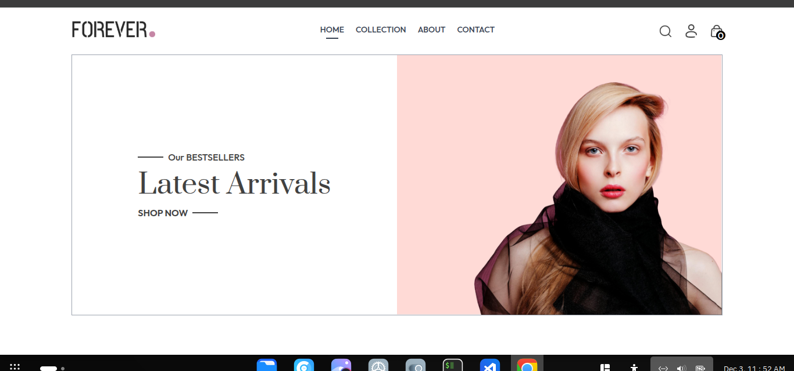
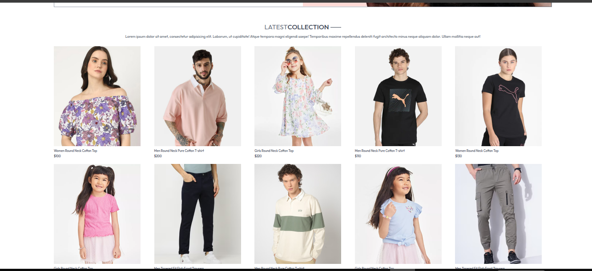
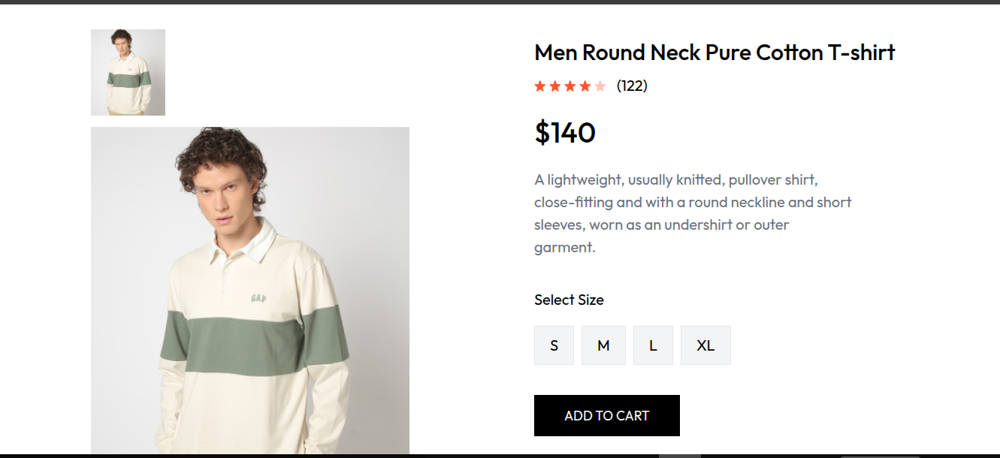
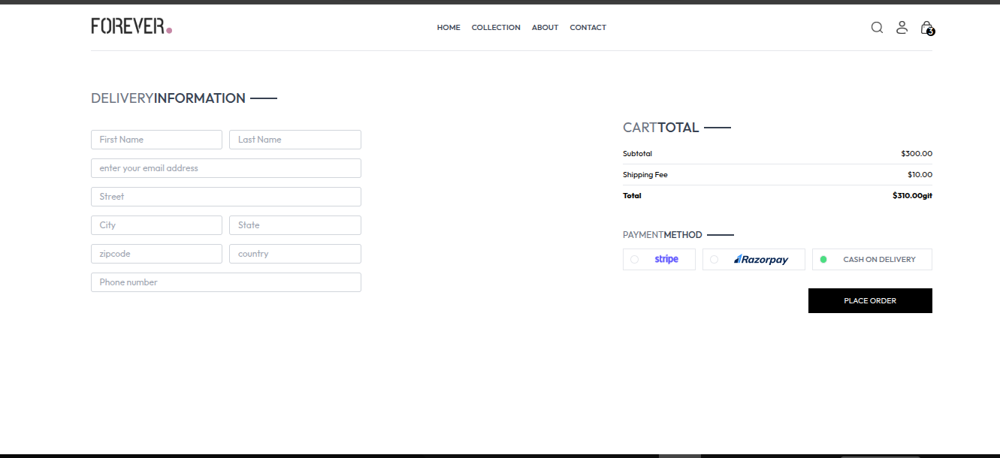

🛍️ Forever Ecommerce — Full Project Documentation

Forever is a modern ecommerce platform built using Next.js (Pages Router) with a scalable component-driven architecture and real-time shopping experience. It includes product browsing, cart management, secure authentication, and Stripe checkout.

🚀 Features

Product listing, filtering and search

Dynamic product detail pages

Shopping cart with persistent state

User authentication (JWT)

Secure checkout with Stripe

Order history for logged-in users

Newsletter subscription

Clean, responsive UI using Tailwind

Modular reusable components

🧠 Tech Stack
Layer	Technology
Framework	Next.js (Pages Router)
Frontend Library	React + Hooks
Styling	Tailwind CSS
State	Context API
Payments	Stripe Checkout
Auth	JWT Tokens
Types	TypeScript
📁 Project Structure

This project does not use /src.
Everything is structured at the root level:

.
├── assets            # images / icons / product media
├── components        # reusable UI blocks
├── context           # global state management (ShopContext)
├── pages             # Next.js routing pages
│   ├── index.tsx
│   ├── collection.tsx
│   ├── product/[id].tsx
│   ├── cart.tsx
│   ├── placeorder.tsx
│   ├── orders.tsx
│   ├── login.tsx
│   ├── about.tsx
│   ├── contact.tsx
├── styles            # Tailwind + global styles
├── public            # static files
├── types             # global TypeScript definitions
├── tsconfig.json
└── README.md

🎨 UI Components

All important UI parts live under /components:

🧩 Core building blocks

navbar.tsx → Navigation + cart counter + login button

hero.tsx → Landing banner

BestSeller.tsx → Featured product section

productItem.tsx → Single product card

relatedproducts.tsx → Recommended products

searchBar.tsx → Query-based search

Title.tsx → Reusable titles

OurPolicy.tsx → Shipping / returns info

CartTotal.tsx → Total + discount + checkout button

Footer.tsx → Footer links & brand sections

NewsLettterBox.tsx → Email subscription UI

latestCollection.tsx → New arrivals block

This makes the project DRY and scalable.

🔐 Authentication (JWT)

Users authenticate using JSON Web Tokens.

Flow

User enters credentials

Backend returns JWT

Token stored locally

Protected requests include Authorization headers

User gets access to checkout, orders, etc.

Future improvement: Move to HTTP-only secure cookies.

🛒 Shopping Cart Logic

Cart state is managed globally using ShopContext.

Add/remove products

Increment/decrement quantities

Persist cart on reload

Calculate totals dynamically

Example model
CartItems: Record<string, number> // { productId: quantity }

Cart total:

sum(price × qty)

🌐 Routing (Pages Router)

Every .tsx file in /pages becomes a route.

Page	Route	Description
Home	/	Landing page
Collection	/collection	Browse all products
Product	/product/[id]	Product detail
Cart	/cart	Cart view
Checkout	/placeorder	Checkout
Orders	/orders	Order history
Login	/login	Auth
About	/about	Brand
Contact	/contact	Support
🧠 ShopContext Overview

Centralized app logic:

Product list

Cart items

Auth session

User data

Global helpers

Benefits

Zero prop drilling

Global sharing of state

Simplifies UI logic

💳 Stripe Checkout

User clicks checkout

Stripe Session is generated

Redirect to Stripe payment page

Stripe webhook confirms order

Backend stores order

No card data stored locally → secure by default.

🧾 Product Type Example
type Product = {
  id: string;
  name: string;
  price: number;
  image: string;
  category: string;
  description: string;
  sizes?: string[];
  reviews?: Review[];
};

📱 Responsive UI

Designed to be mobile-first:

Flexbox + Grid

Breakpoints via Tailwind

Minimal clutter

Professional storefront look

🏁 Getting Started
1️⃣ Install dependencies
npm install

2️⃣ Run dev server
npm run dev

3️⃣ Open in browser
http://localhost:3000

🔑 Environment Variables

Setup your .env.local

NEXT_PUBLIC_API_URL=...
JWT_SECRET=...
NEXT_PUBLIC_STRIPE_KEY=...
STRIPE_SECRET_KEY=...

If using a backend:

DB_URL

CLOUDINARY_KEYS

GOOGLE_EMAIL_SMTP

🚀 Deployment (Recommended: Vercel)

Push to GitHub

Connect repo to Vercel

Add environment variables

Deploy

Vercel handles:

SSR

CDN

Assets

Environment configs

🔧 Scripts
npm run dev      # Dev environment
npm run build    # Production build
npm start        # Run production

🛡️ Security Notes

Never store sensitive JWT in localStorage for real users

Prefer HTTP-only cookies

Validate backend quantities

Check Stripe webhooks

Sanitize inputs

🧩 Future Features

Admin dashboard

Inventory management

Vendor marketplace

Live order tracking

Redis caching

Real reviews system

Wishlist

Analytics

🤝 Contributing

Contributions welcome!
Fork repo → Feature branch → Pull request.

📄 License

MIT License
Free to use, modify and extend.

🧔 Author

Built with ❤️ by Berry Mundia (Godzilla)
For business inquiries or partnership → add contact links

